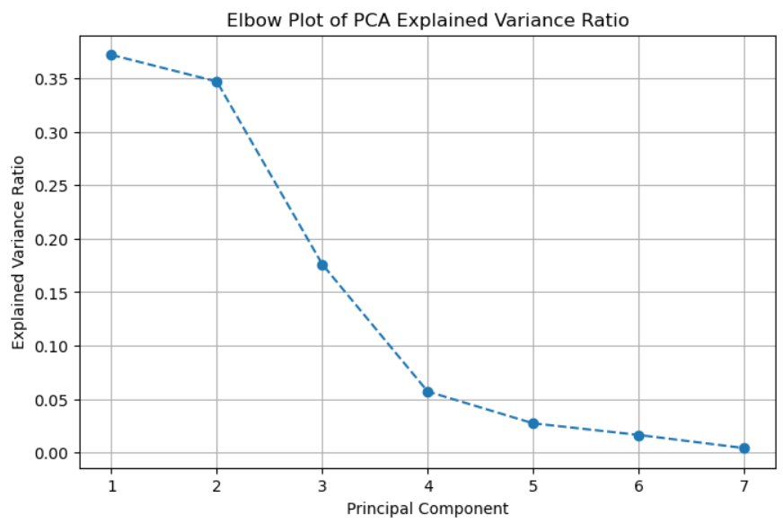
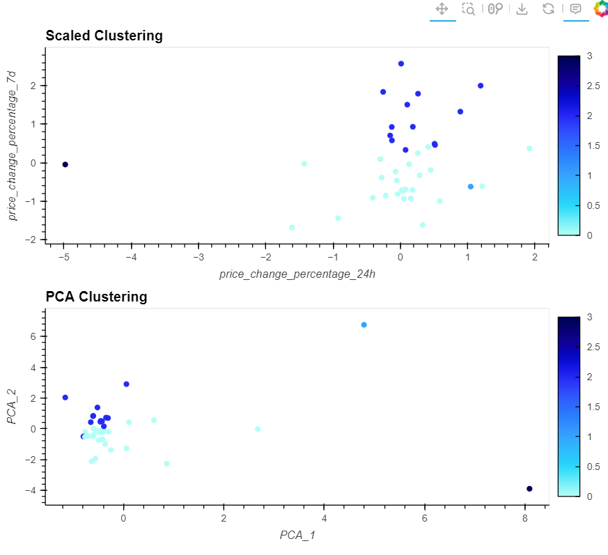

# dabc_challenge_19.unsupervised_ml
Module 19 - Unsupervised Machine Learning

For this assignment, I used a Python notebook to explore unsupervised machine learning techniques on a dataset of cryptocurrency value changes. 

First, the data was scaled for algorithm use. Then, I created a Kmeans model that looped through the scaled data and generated metrics for inertia, silhouette score, and variance ratio criterion for each potential value of k. I also plotted these k values against inertia in a line graph to better visualize the values. With the ideal value for k determined, I created a scatter plot of predicted clusters of data points.

Next, I optimized the clusters with principal component analysis. As seen in the correlation heatmaps, the data was highly correlated before pca analysis. I also created a line graph to view the explained variance ratio between the different principal components. With the top three components accounting for 89.5% of the variance in the data, I recreated my Kmeans elbow curve and scatter plots using the top 3 principal components and the ideal value for k. 

The composite plots show the scaled vs PCA data for both the elbow curves and the scatter plots, allowing for direct visualization of how the principal component analysis limits variation between data points and also more clearly shows how the two outlier cryptocurrency coins may be skewing aggregate views of the data.

